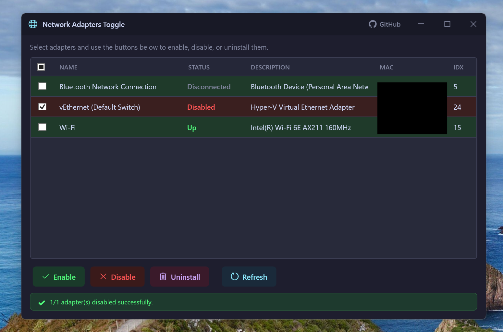

# Network Adapters Toggle

A lightweight Windows utility to quickly enable and disable network adapters. Built for Windows 11 users and sysadmins who need fast access to adapter management without digging through Settings or Device Manager.



## Features

- Lists **all** network adapters (Wi-Fi, Ethernet, vEthernet, VPN, etc.)
- **Checkbox selection** — pick which adapters to act on
- **Enable / Disable** selected adapters with one click
- **Verifies** state changes after each operation
- **Persists** your adapter selection in a local `settings.ini` file
- Dark theme, modern WPF interface
- Runs elevated (UAC prompt) — required for adapter management
- Framework-dependent — tiny ~160KB executable

## Requirements

- Windows 10 or 11
- [.NET Desktop Runtime 10.0](https://dotnet.microsoft.com/download/dotnet/10.0) or later, will be installed automatically if needed
- Administrator privileges (prompted via UAC on launch)

## Usage

1. Download `NetworkAdaptersToggle.exe` from the [Releases](../../releases) page
2. Run the exe — accept the UAC elevation prompt
3. Check the adapters you want to manage
4. Click **Enable Selected** or **Disable Selected**
5. The status bar confirms success or reports failures

Your adapter selection is saved automatically to `settings.ini` next to the exe.

## Build from Source

```bash
# Clone the repo
git clone https://github.com/mayerwin/NetworkAdaptersToggle.git
cd NetworkAdaptersToggle

# Build
dotnet build src/NetworkAdaptersToggle

# Publish (framework-dependent)
dotnet publish src/NetworkAdaptersToggle -c Release --no-self-contained -o ./publish
```

## How It Works

Under the hood, the app calls PowerShell:

```powershell
# List adapters
Get-NetAdapter | Select-Object Name, Status, InterfaceIndex, InterfaceDescription, MacAddress, LinkSpeed | ConvertTo-Json

# Enable
Enable-NetAdapter -InterfaceIndex <id> -Confirm:$false

# Disable
Disable-NetAdapter -InterfaceIndex <id> -Confirm:$false
```

After each toggle, the app re-queries adapters to verify the state actually changed before reporting success.

## License

MIT
